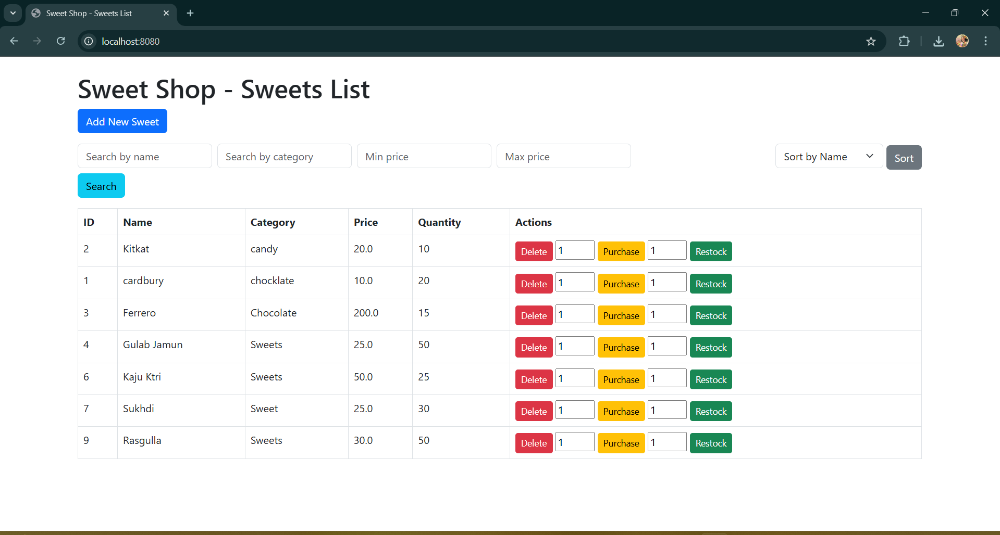

# Sweet Shop Management System

A simple Java Spring Boot web application for managing a sweet shop, following TDD and clean code practices.

## Features
- Add, delete, view sweets
- Search by name, category, or price range
- Sort by name, price, or quantity
- Purchase and restock sweets (with inventory checks)
- Simple, responsive web UI (Thymeleaf + Bootstrap)
- Full JUnit test coverage

## TDD Approach
This project was developed using Test-Driven Development (TDD):
- For each feature, a failing test was written first (Red phase).
- The minimum code to pass the test was implemented (Green phase).
- Code was then refactored for clarity, maintainability, and SOLID principles (Refactor phase).
- This cycle was repeated for all core features: add, delete, search, sort, purchase, and restock.
- Each step is reflected in the commit history for transparency and traceability.

## Technologies Used
- Java 8
- Spring Boot 2.7
- Thymeleaf (for HTML templates)
- Maven (build tool)
- JUnit 4 (unit testing)
- Bootstrap 5 (UI styling)

## Setup & Run

### Prerequisites
- Java 8+
- Maven 3.6+

### Steps
1. **Clone the repository**
   ```sh
   git clone <https://github.com/dhaval4133/Incubyte-Assesment.git>
   cd sweetshop
   ```
2. **Build the project**
   ```sh
   mvn clean install
   ```
3. **Run the application**
   ```sh
   mvn spring-boot:run
   ```
4. **Open in browser**
   Visit [http://localhost:8080/](http://localhost:8080/)

## Test Cases
A comprehensive suite of JUnit test cases is provided to ensure all core features work as expected:
- Add sweet
- Delete sweet
- View all sweets
- Search sweets by name, category, and price range
- Sort sweets by name, price, and quantity
- Purchase sweets (with stock validation)
- Restock sweets

To run all tests and see a report:
```sh
mvn test
```
Test results will be available in `target/surefire-reports/`.

## Project Structure
- `src/main/java/com/sweetshop/` - Java source code
- `src/main/resources/templates/` - Thymeleaf HTML templates
- `src/test/java/com/sweetshop/` - JUnit tests

## Screenshots



## Sources
- All code in this repository is original and written for this project.
- No code was copied from other repositories.
- Official documentation and references used:
    - [Spring Boot Documentation](https://spring.io/projects/spring-boot)
    - [Thymeleaf Documentation](https://www.thymeleaf.org/documentation.html)
    - [JUnit 4 Documentation](https://junit.org/junit4/)
    - [Maven Documentation](https://maven.apache.org/)


## Special Thanks
To Incubyte for the opportunity to participate in this assessment 

To LDCE for organizing the Campus placement drive.


## Author
- Developed by Dhaval Dangar